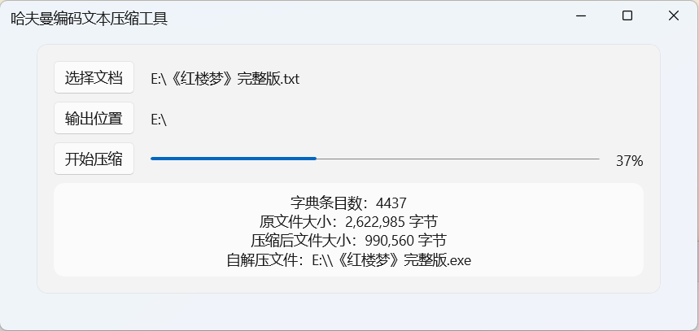

# HuffmanSFX
基于哈夫曼树的文本压缩存储与自解压工具，使用 .NET 实现。

## 功能与特点
- **编码程序**：使用 WinUI 3（.NET 9）实现，提供现代化界面和高效性能。
- **自解压程序**：使用 WPF（.NET 4）实现，确保兼容性，支持在较旧系统上运行。
- **文档支持**：仅支持 UTF-8 编码的 `.txt` 文档。

## 工具预览

### 压缩程序界面

### 自解压程序界面
